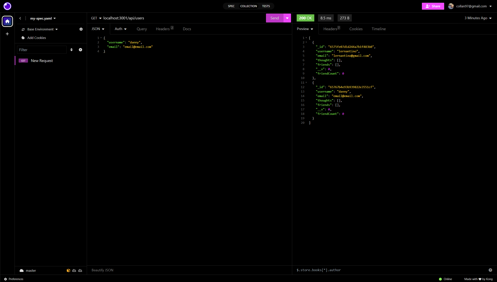

# NoSQL Social Network API

## User Story

```md
AS A social media startup
I WANT an API for my social network that uses a NoSQL database
SO THAT my website can handle large amounts of unstructured data
```

## Acceptance Criteria

```md
GIVEN a social network API
WHEN I enter the command to invoke the application
THEN my server is started and the Mongoose models are synced to the MongoDB database
WHEN I open API GET routes in Insomnia for users and thoughts
THEN the data for each of these routes is displayed in a formatted JSON
WHEN I test API POST, PUT, and DELETE routes in Insomnia
THEN I am able to successfully create, update, and delete users and thoughts in my database
WHEN I test API POST and DELETE routes in Insomnia
THEN I am able to successfully create and delete reactions to thoughts and add and remove friends to a user’s friend list
```

## Objective

From scratch, create an application that will perform CRUD operations using Mongoose to work with a MongoDB database. To perform these operations, utilize Insomnia to be able to successfully work with 'user' and 'thought' schemas. Be able to do GET, POST, PUT, and DELETE operations as you are inside of Insomnia using the source 'localhost:3001/'. For a bonus, be able to remove a user's associated thoughts as you are performing the DELETE operation for a specific user.



## Video Walkthrough Link

https://youtu.be/hpfKxUrX6IU

## How to Run

1. Run 'git clone (repo link)' on Git Bash'
2. CD into project directory
3. Run project via code editor (e.g. Visual Studio Code)
4. Open the terminal
5. Run 'npm install' to download all necessary dependencies
6. Run 'npm start'
7. With the server now running, navigate to Insomnia, and work with localhost:3001 for performing CRUD operations